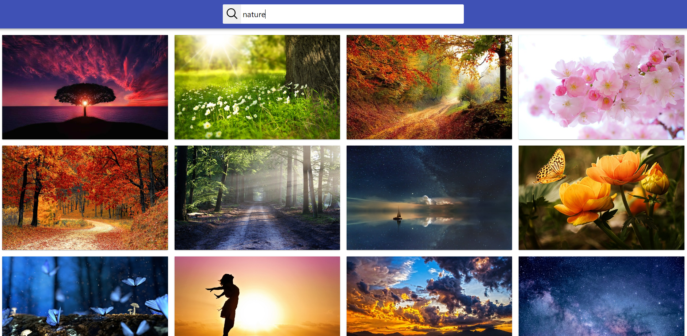
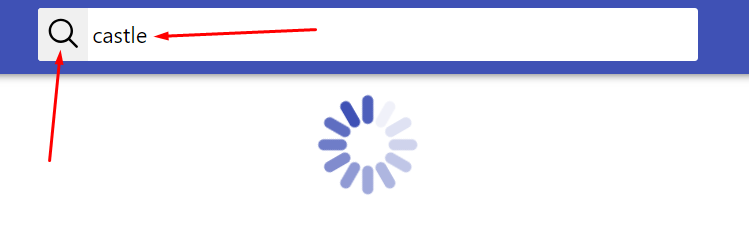

**Read in other languages: [polski](README.pl.md).**

# ImageFinderApp

Simple image finder app created to allow you to search web for pictures
depending on your request. Write what are you looking for in input field and
then press search button or enter. App will search web with you query. Created
with React.js, HTML, CSS, JS, and a bit of passion...

---

## Demo

Here is working live demo: (
https://krystianklimczak.github.io/goit-react-hw-03-image-finder/ )

---

## Site

### Leading page

### Simply just write anything and press search button

### You can load more images if u want to

---

## Technologies

- HTML
- CSS
- JavaScript
- React.js

---

## Setup

Clone this repo to your desktop and run `npm install` to install all the
dependencies.

---

## Usage

After you clone this repo to your desktop, go to its root directory and run
`npm install` to install its dependencies.

Once the dependencies are installed, you can run `npm start` to start the
application. You will then be able to acces it at localhost:3000

---

## Feel free to share your opinion

- https://www.linkedin.com/in/klima96/
